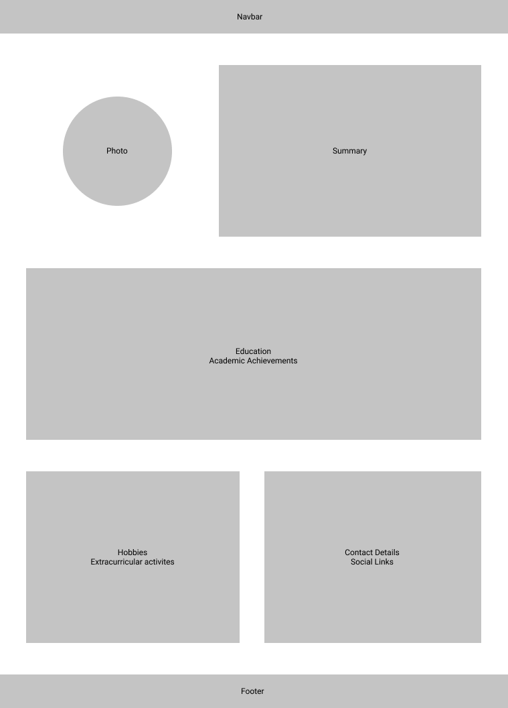

**Aim:** Understand basics of HTML and CSS.

**Duration:** 3 weeks

**Learning resources:** 

From `Basic HTML and HTML5` to `Responsibe Web Design Principles` sections from https://www.freecodecamp.org/learn/responsive-web-design/

> `CSS Flexbox` and `CSS Grid` sections are not necessary for the project. But both of them are very important topics of CSS that you need to learn.

Above course is simple and short enough for revision but if you need something faster:
- For refreshing HTML: https://www.youtube.com/watch?v=UB1O30fR-EE
- For refreshing CSS: https://www.youtube.com/watch?v=yfoY53QXEnI

**Project:**

Build a CV website using HTML and CSS.
CV should have following sections
- Photo
- Contact Details including address
- Summary
- Education
- Hobbies
  
Include anything else you want.

Layout needed:

